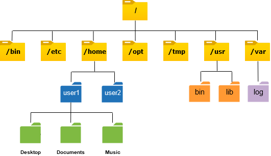

# Linux File System

## 1 root folder

 

# windows file systems
### windows file systems doesn't have one root folder 
it has multiple root folders

# Linux file system overview
in linux file system each user has its own space.
only `root` user has its own space called `/root` 
programs installed system wide, are available for all users on that pc.
#most essential directories
# /bin - binaries

basic command for instance `ls`, `cp` are stored in the `/bin` directory

# /sbin - system binaries

system wide binaries basicly these commands need super user privileges to execute.
essential system binaries programs that admin would use.

# /lib - library
The /lib directory contains kernel modules and those shared library images (the C programming code library) needed to boot the system and run the commands in the root filesystem, ie. by binaries in /bin and /sbin. Libraries are readily identifiable through their filename extension of *.so. Windows equivalent to a shared library would be a DLL (dynamically linked library) file. They are essential for basic system functionality. Kernel modules (drivers) are in the subdirectory /lib/modules/'kernel-version'. To ensure proper module compilation you should ensure that /lib/modules/'kernel-version'/kernel/build points to /usr/src/'kernel-version' or ensure that the Makefile knows where the kernel source itself are located.

# /usr - user

# /opt - Optional
where third-party programs will be installed `chrome`, `brave`, `teams` and so on.

`usr/local` -> programs, which split it's components
`/opt` - > programs, which NOT split its components

# /boot - booting
contains files required for booting

# /etc 
place where configuration for system-wide applications is stored 
for instance nginx config or network config and so on ...

# /dev - devices
location of device files - like webcam, keyboard, hard drive etc.
apps and driver will access this directory, not the user.

# /var  - variable
contains files to which the system writes data during the course of its operation.
- `/var/log` contains log files
- `/var/cache` contains cached data from application programs

# /tmp - temporary
temporary resources required for some process, kept here temporarily

# /media - removable media
contains subdirectories, where removable media devices inserted into the computer are mounted.
E.g. when you insert a CD or USB or external Drive. A directory will automatically be created and you can access the contets of the (CD, USB, external drive) inside the directory.

# LINUX file system Overview with 1 good pic :)

# Hidden files
Hidden files is primarily used to help prevent important data from being accidentally delted
-Automatically generated by programs or OS
-all file name starts with `.`
-In `UNIX` hidden files also called `dotfiles` 