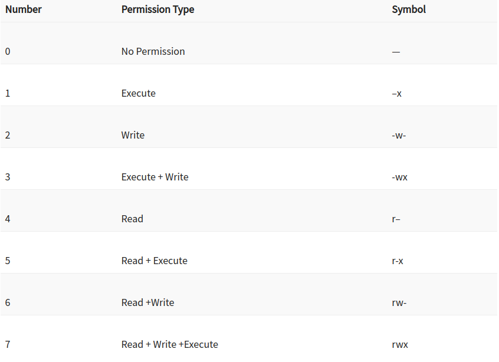

# Ownership
change ownership of the file or folder
`chown <username>:<groupname> <filename>`

change ownership of the file or folder with`chgrp` 
owner will become group instead of specific user.

`chgrp <groupName> <filename>`

# file permission

## remove permissions

remove execute `x` permissions for everybody
`sudo chmod -x api`

remove permission for group
`sudo chmod g-w config.yaml`

## add permission

`sudo chmod g+x config.yaml`

give permission to `others`

`sudo chmod o+x config.yaml`
# change multiple permissions

`sudo chmod g=rwx config.yaml`

this command will give only Read permission to the group
`sudo chmod g=r-- config.yaml`

# Absolute(Numberic) Mode
